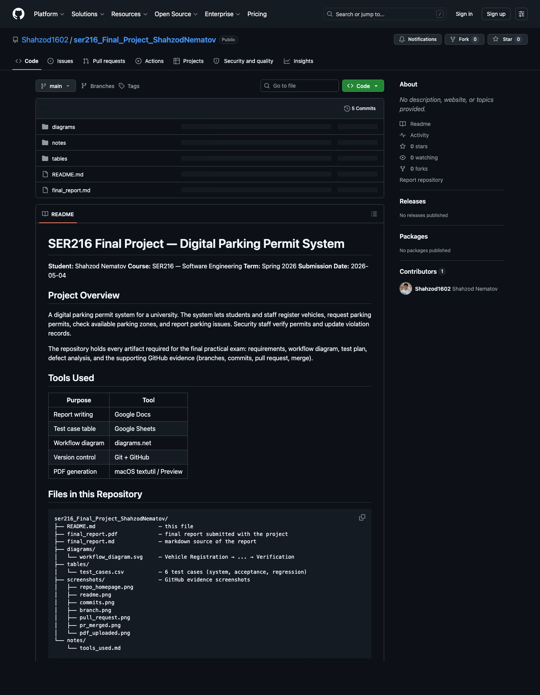
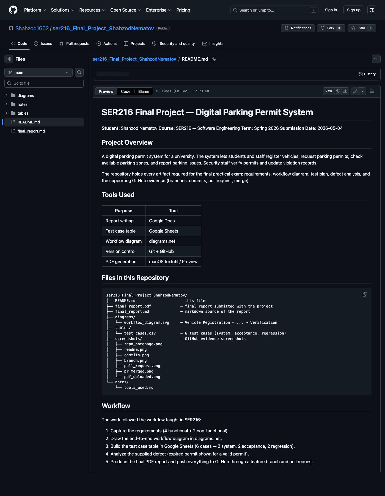
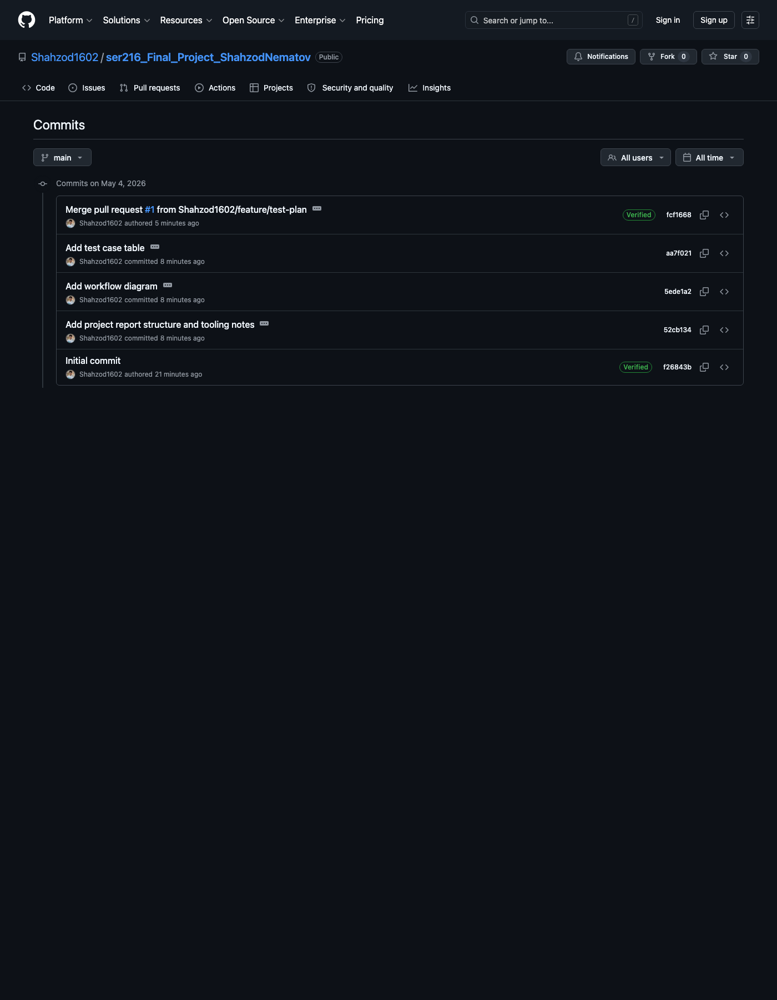
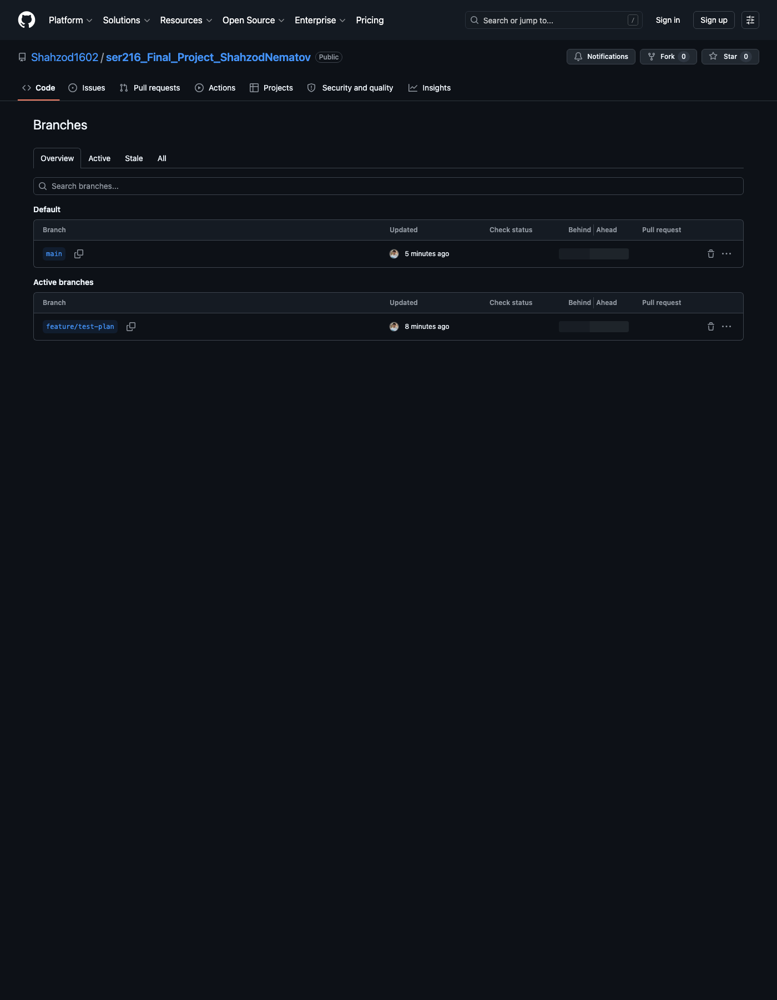
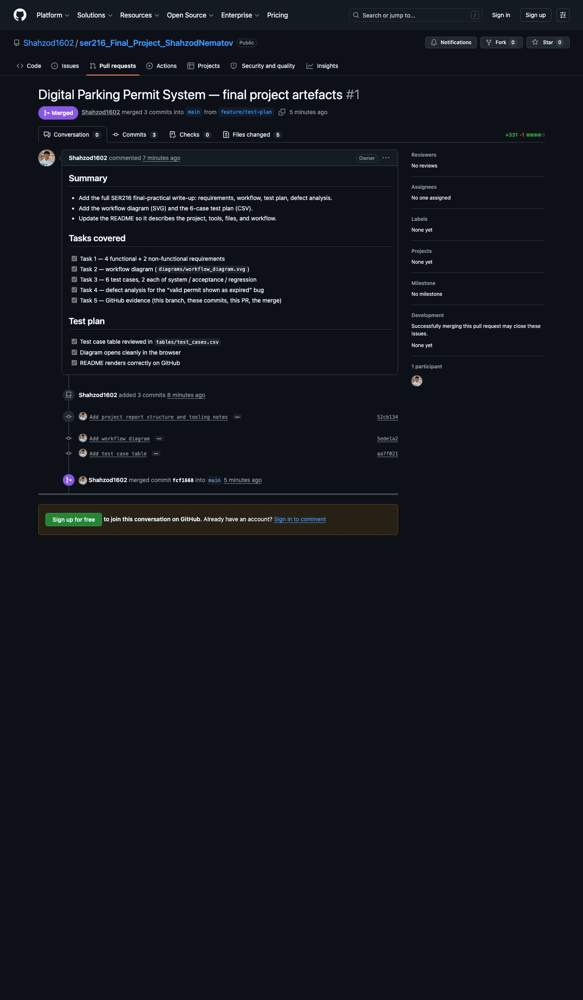
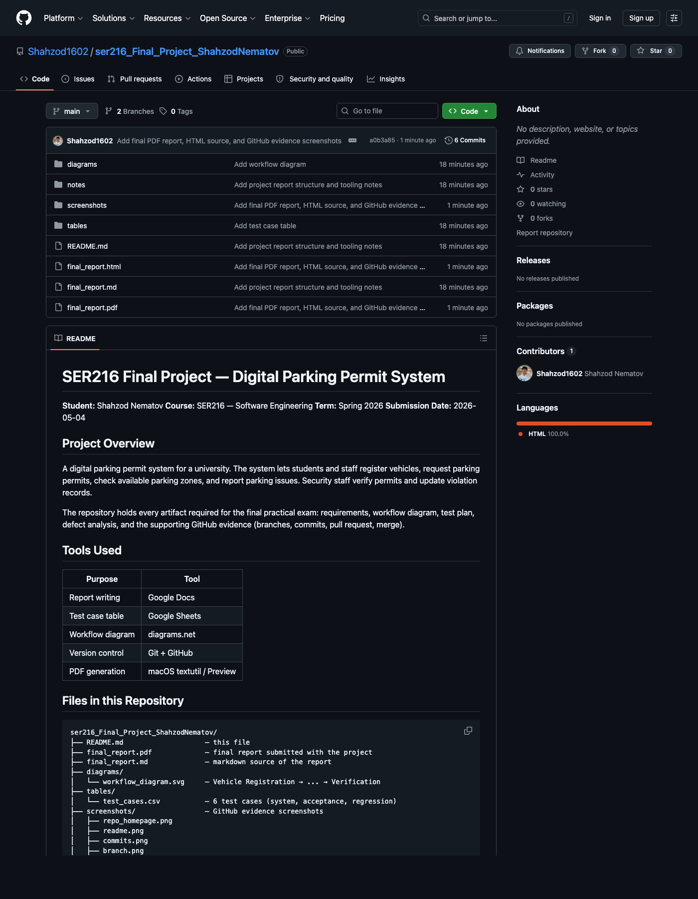

# SER216 Final Practical Project
## Digital Parking Permit System — Final Report

**Student:** Shahzod Nematov
**Course:** SER216 — Software Engineering
**Term:** Spring 2026
**Date:** 2026-05-04
**Repository:** <https://github.com/Shahzod1602/ser216_Final_Project_ShahzodNematov>

---

## Scenario Recap

A university wants a digital parking permit system. Students and staff can
register vehicles, request parking permits, check available parking zones,
and report parking issues. Security staff can verify permits and update
violation records.

---

## Task 1 — Requirements

### Functional Requirements

1. **FR-1 Vehicle Registration.** A student or staff member shall be able to
   register a vehicle by entering plate number, make, model, color, and owner
   ID. The system shall reject duplicate plate numbers.
2. **FR-2 Permit Request.** A registered user shall be able to submit a
   parking permit request, choosing the desired zone (A/B/C/Visitor) and the
   permit period (semester, annual, daily). The system shall return a request
   confirmation number.
3. **FR-3 Zone Availability Check.** The system shall display real-time
   availability of each parking zone (free spots, capacity, and status:
   open / full / closed) so users can pick a zone before requesting a permit.
4. **FR-4 Permit Verification by Security.** Security staff shall be able to
   scan or enter a permit ID and immediately see whether the permit is
   valid, expired, suspended, or unknown, along with the linked vehicle and
   owner.

### Non-Functional Requirements

1. **NFR-1 Performance.** Permit verification at security gates shall return a
   result within **2 seconds** for 95% of requests under a load of 200
   concurrent verifications.
2. **NFR-2 Security & Privacy.** All personal data (owner ID, plate, address)
   shall be transmitted over TLS 1.2+, stored encrypted at rest, and access
   shall be limited by role (student, staff, security, admin) so that
   security officers can read permit status but cannot edit owner records.

---

## Task 2 — Workflow Diagram

The end-to-end workflow drawn in diagrams.net:

```
+----------------------+     +-----------------+     +-----------------+
|   Vehicle            | --> |   Permit        | --> |   Zone Check    |
|   Registration       |     |   Request       |     |   (availability)|
+----------------------+     +-----------------+     +-----------------+
                                                              |
                                                              v
                                                     +-----------------+
                                                     |  Permit         |
                                                     |  Approval       |
                                                     +-----------------+
                                                              |
                                                              v
                                                     +-----------------+
                                                     |  Parking        |
                                                     |  Verification   |
                                                     |  (Security)     |
                                                     +-----------------+
```

The image version of this workflow is stored at
`diagrams/workflow_diagram.svg`.

---

## Task 3 — Test Case Table

Stored in machine-readable form at `tables/test_cases.csv`. Six cases — two
system, two acceptance, two regression.

| Test ID | Feature                | Input / Data                                                                              | Expected Result                                                                  | Test Type   |
| ------- | ---------------------- | ----------------------------------------------------------------------------------------- | -------------------------------------------------------------------------------- | ----------- |
| TC-01   | Permit Request Flow    | Registered user requests a Zone A semester permit; chosen zone has free capacity          | Permit request is saved, status `Pending Approval`, confirmation number returned | System      |
| TC-02   | Permit Verification    | Security scans valid permit ID linked to a registered vehicle at an open gate             | System shows `VALID`, owner name, plate, expiry date — within 2 seconds          | System      |
| TC-03   | Student Self-Service   | Student logs in and registers a new vehicle with valid data                               | Vehicle appears in `My Vehicles`; user feels the flow is intuitive (UAT pass)    | Acceptance  |
| TC-04   | Security UAT           | Security officer verifies 10 different permits during a shift drill                       | All results displayed clearly within 2 s; officer confirms workflow is workable  | Acceptance  |
| TC-05   | Duplicate Plate Guard  | After login fix, register a vehicle with a plate that already exists in the system        | System rejects the registration with the same error message as before the fix   | Regression  |
| TC-06   | Permit Expiry Display  | After defect fix, verify a permit whose expiry date is in the future                      | Permit shows `VALID` (no longer mistakenly shown as `EXPIRED`)                   | Regression  |

System testing checks the integrated end-to-end behaviour of the whole
application; acceptance testing checks that real users (students and security
staff) agree the system meets their expectations and the business rules.

---

## Task 4 — Defect Analysis

> **Defect:** "A valid parking permit is shown as expired during security
> verification."

| Item                | Analysis                                                                                                                                                                                                                                                                                                          |
| ------------------- | ----------------------------------------------------------------------------------------------------------------------------------------------------------------------------------------------------------------------------------------------------------------------------------------------------------------- |
| **Defect category** | Functional defect — incorrect business-logic output. Specifically a date / time-zone calculation bug in the permit verification module.                                                                                                                                                                          |
| **Severity**        | **High.** A valid permit holder is wrongly flagged as expired, which blocks legitimate users from parking and forces security to override the system manually. It does not crash the system, so it is not Critical, but it directly breaks a core feature.                                                       |
| **Priority**        | **High / P1.** Must be fixed in the next release. The defect happens on the security gate path, which runs many times per day and is highly visible to end users and to the university administration.                                                                                                          |
| **Possible root cause** | The expiry comparison most likely uses the server's local date while the permit's `expiry_date` is stored in UTC (or vice-versa). When the verification runs after midnight local time but before midnight UTC, today's date is still ≤ expiry in UTC but already > expiry after a naive local-date cast. Other candidates: off-by-one on the inclusive/exclusive end date, or a stale cached permit status not refreshed after renewal. |
| **Regression test** | TC-06 in the test plan: after the fix, verify a permit whose `expiry_date` is in the future across multiple time-zone boundaries (just before midnight local, just after midnight local, and on the exact expiry day). Expected result: status `VALID` in all three runs. Add this test to the regression suite so the bug cannot return. |

---

## Task 5 — GitHub Evidence

All seven evidence artefacts are present in this repository:

| # | Requirement              | Where to find it                                                              |
| - | ------------------------ | ----------------------------------------------------------------------------- |
| 1 | Repository created       | <https://github.com/Shahzod1602/ser216_Final_Project_ShahzodNematov>          |
| 2 | README.md                | `README.md` in the repo root                                                  |
| 3 | Feature branch           | `feature/test-plan` (visible in the branch dropdown)                          |
| 4 | At least 3 commits       | Commit history on `feature/test-plan` and on `main` after merge               |
| 5 | Pull request             | Pull Requests tab — PR from `feature/test-plan` → `main`                      |
| 6 | Pull request merged      | The same PR shows the purple "Merged" badge                                   |
| 7 | Final PDF uploaded       | `final_report.pdf` in the repo root                                           |

Screenshots of each item are stored in `screenshots/` and embedded below.

### Screenshot — Repository Homepage


### Screenshot — README rendered


### Screenshot — Commit history (≥ 3 commits)


### Screenshot — Feature branch


### Screenshot — Pull request


### Screenshot — Pull request merged


### Screenshot — Final PDF uploaded in repo


---

## Submission Checklist

- [x] 4 functional + 2 non-functional requirements
- [x] Workflow diagram (Vehicle Registration → Permit Request → Zone Check → Permit Approval → Parking Verification)
- [x] 6 test cases (2 system, 2 acceptance, 2 regression)
- [x] Defect analysis (category, severity, priority, root cause, regression test)
- [x] Repository created on GitHub
- [x] README.md describing project, tools, files, workflow
- [x] Feature branch `feature/test-plan`
- [x] ≥ 3 meaningful commits
- [x] Pull request opened
- [x] Pull request merged
- [x] Final PDF uploaded
- [x] Repository link inside the report

— End of report —
